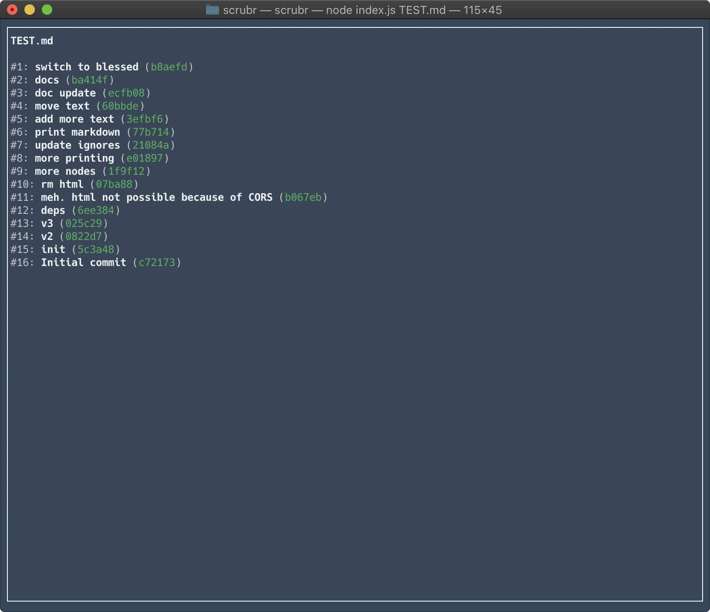
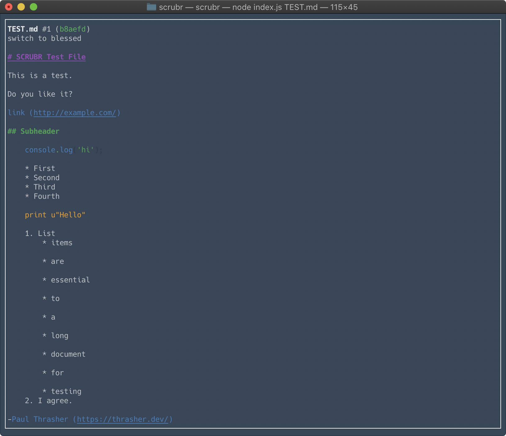

# SCRUBR

A CLI app for scrubbing through markdown document versions in git.

## Install

> npm install

## Run

> node index.js TEST.md

## Use

Press the `right` and `left` keys to scrub between git commits.

Press `q` or `ctrl-c` to quit.

